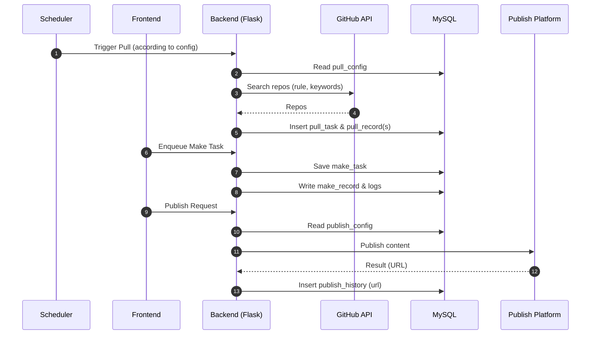

# 系统逻辑框架与核心功能梳理

更新时间: 2025-12-15T08:44:15.768Z

## 一、总体逻辑框架（域驱动视角）
- 抓取域（Pull/Fetch）
  - 抓取配置 → 生成抓取计划（频率、开始时间、并发、间隔、批次）
  - 抓取任务 → 按计划入队执行（支持 GitHub/Gitee，多规则筛选）
  - 抓取记录 → 记录每次拉取的结果（时间、项目、star/fork、路径）
- 制作域（Article Make）
  - 制作配置 → 定义生成策略、模型与外部解析 API 设置
  - 制作任务 → 队列执行并产生日志
  - 制作记录 → 产物与状态沉淀，供后续审核/发布
- 发布域（Publish）
  - 发布配置 → 平台/账号/API Key 与发布时间
  - 发布历史 → 每次发布的状态与回执
  - 外网链接 → 汇总外部平台访问链接
- 横切能力
  - 调度（每周/每天、开始时间、并发、间隔、批次）
  - 审计与日志（任务日志、操作审计）
  - 可观测性（健康检查、任务结果统计）

数据流：抓取配置 → 抓取任务 → 抓取记录 → 制作任务 → 制作记录/审核 → 发布历史/外网链接。

## 二、抓取核心
- 抓取配置
  - 来源：GitHub、Gitee（可扩展）
  - 关键字：英文逗号分隔（多关键字匹配）
  - 拉取规则（参考 GitHub 筛选）：
    - best_match（最佳匹配）
    - most_stars（最多 Star）
    - most_forks（最多 Fork）
    - trending（近期热门，Star/Fork 增长快）
  - 计划设置：
    - 频率：weekly/daily
    - weekly：周起始（周日~周六）、每周次数（1~7）
    - startTime：开始时间（HH:mm）
    - 并发：一次拉取的线程数
    - perProjectDelay：项目间隔（分钟）
    - batch：每次拉取项目数（M）
- 抓取任务
  - 字段：任务ID、来源、规则、计划快照、状态、创建/开始/结束时间、并发参数
- 抓取记录
  - 字段：任务ID、项目（owner/name、url）、pullTime、stars、forks、保存路径、结果状态

## 三、制作核心
- 制作配置：模型/解析提供方（provider/base_url/model）、必要凭据（可选）
- 制作任务：任务ID、输入素材（抓取记录或人工指定）、状态、日志
- 制作记录：产出（markdown/HTML 等）、关联任务、时间、状态
- 审核：预览、意见、通过/回退到制作任务池

## 四、发布核心
- 发布配置：平台（公众号/知乎/掘金…）、发布账号、API Key、发布时间（HH:mm）
- 发布历史：标题、平台、发布时间、状态、回执/链接
- 外网链接：平台、标题、最终外链

## 五、前后端映射（当前前端路由）
- 项目拉取
  - /pull/config（拉取配置）
  - /pull/records（拉取记录）
- 文章制作
  - /article/tasks（制作任务/日志）
  - /article/audit（文章审核/意见/回退）
- 文档发布
  - /publish/config（发布配置：平台/账号/API Key/时间）
  - /publish/history（发布历史，包含外部链接列）
- 模型配置
  - /model-config（外部解析 API 设置等）

后端现有/计划接口（示例）：
- GET /api/repos、/api/stats、/api/health
- POST /api/analyze（外部解析入口：provider/base_url/model/api_key）
- 文章：/api/article/latest、/api/article/save、/api/article/regenerate
- 规划中：
  - 抓取：POST /api/pull/config、POST /api/pull/test、GET /api/pull/records
  - 制作：POST /api/make/config、POST /api/make/enqueue、GET /api/make/tasks、GET /api/make/logs
  - 发布：POST /api/publish/config、POST /api/publish/test、GET /api/publish/history

## 六、调度与执行约定
- 定时策略：daily/weekly + startTime（HH:mm）+ 次数（weekly 模式）
- 资源控制：concurrency（并发）+ perProjectDelay（分钟）
- 幂等与重试：基于任务ID与项目指纹控制；失败重入队

## 七、存储与目录约定（建议）
- data/ 抓取数据与中间结果
- articles/ 制作产物（md/html）与最新预览
- logs/ 任务日志与审计记录

## 八、基础设施与运行
- Docker 服务：
  - backend：Flask，端口 5001→容器 5000
  - frontend：Nginx/Vite 静态，端口 3001→容器 80
  - mysql：MySQL 8.0，端口 3606→容器 3306
- MySQL 初始化：scripts/mysql/init/001_schema.sql 挂载至 /docker-entrypoint-initdb.d，首次启动自动建表
- 环境变量（必须）：MYSQL_ROOT_PASSWORD、MYSQL_USER、MYSQL_PASSWORD（可选 MYSQL_DATABASE，默认 github_daily_report）

## 九、待办（Roadmap）
- 后端：完善抓取/制作/发布 API 与任务调度器；补充权限与审计
- 前端：对接真实数据源，增加状态筛选与分页；表格批量操作
- 运维：容器健康检查完善、告警/通知（Webhook/IM）

## 十、UML 图

### 10.1 组件/部署图（Mermaid）
```mermaid
flowchart LR
  FE[Frontend (Vue + ElementPlus)\nPort 3001] -->|HTTP /api| BE[Backend (Flask)\nPort 5000]
  BE --> DB[(MySQL 8.0\nPort 3306)]
  BE --> GH[GitHub API]
  BE --> PUB[Publish Platforms\n(WeChat/知乎/掘金)]
  subgraph Docker
    FE
    BE
    DB
  end
```

### 10.2 流程时序图：抓取→制作→发布


