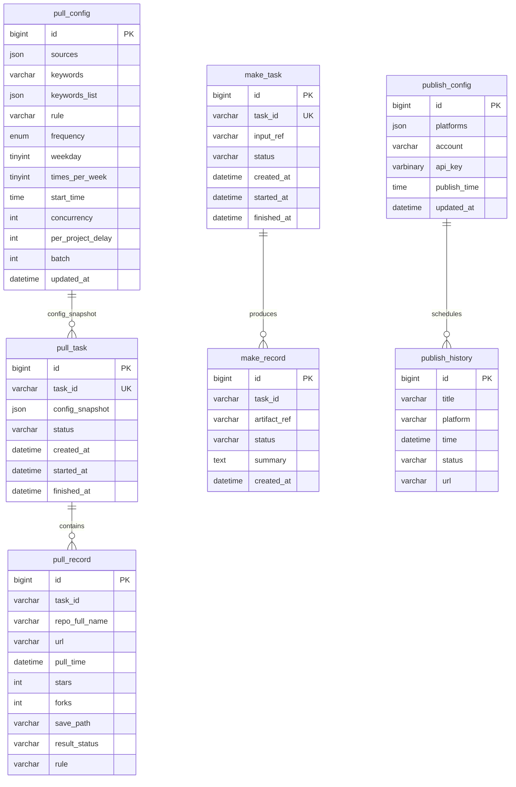

# MySQL 存储规划与落地建议

更新时间: 2025-12-15T08:44:15.768Z

## 1. 适合进入 MySQL 的数据
- 抓取域
  - 抓取配置（pull_config）：来源、关键词（逗号分隔/数组）、规则、频率（daily/weekly）、weekday、times_per_week、start_time、concurrency、per_project_delay、batch、updated_at
  - 抓取任务（pull_task）：task_id、config_snapshot、状态、创建/开始/结束时间、并发参数
  - 抓取记录（pull_record）：task_id、repo_full_name、url、pull_time、stars、forks、save_path、result_status、rule
- 制作域
  - 制作配置（make_config）：provider、base_url、model、外部API key（建议加密存储/或使用外部密钥管理）
  - 制作任务（make_task）：task_id、input_ref（关联抓取记录或手动源）、状态、创建/开始/结束时间
  - 制作记录（make_record）：task_id、artifact_ref（文章文件路径/对象存储URL）、状态、生成摘要
- 发布域
  - 发布配置（publish_config）：平台、发布账号、API Key（建议加密）、发布时间
  - 发布历史（publish_history）：title、platform、time、status、url（外部链接列）

说明：
- 频繁查询/筛选/统计的结构化数据建议入库；大文本与日志保留在文件系统（articles/、logs/），库内只保存索引与引用。

## 2. 建表示例（简化）
- pull_config(id PK, sources JSON, keywords VARCHAR, keywords_list JSON, rule VARCHAR, frequency ENUM, weekday INT, times_per_week INT, start_time TIME, concurrency INT, per_project_delay INT, batch INT, updated_at DATETIME)
- pull_task(id PK, config_snapshot JSON, status VARCHAR, created_at DATETIME, started_at DATETIME, finished_at DATETIME)
- pull_record(id PK, task_id FK, repo_full_name VARCHAR, url VARCHAR, pull_time DATETIME, stars INT, forks INT, save_path VARCHAR, result_status VARCHAR, rule VARCHAR)
- make_config(id PK, provider VARCHAR, base_url VARCHAR, model VARCHAR, external_api_key VARBINARY/ENC, updated_at DATETIME)
- make_task(id PK, input_ref VARCHAR, status VARCHAR, created_at DATETIME, started_at DATETIME, finished_at DATETIME)
- make_record(id PK, task_id FK, artifact_ref VARCHAR, status VARCHAR, summary TEXT, created_at DATETIME)
- publish_config(id PK, platforms JSON, account VARCHAR, api_key VARBINARY/ENC, publish_time TIME, updated_at DATETIME)
- publish_history(id PK, title VARCHAR, platform VARCHAR, time DATETIME, status VARCHAR, url VARCHAR)

## 3. 数据去向建议
- MySQL：所有配置、任务、记录、历史等结构化、可筛选统计的数据
- 文件系统：文章内容/生成产物（md/html）、详细运行日志、临时数据缓存

## 4. 迁移策略（最小改动）
- 先落表与DAO接口，前端对接既有 JSON API，不立即替换；
- 后端在写记录时同时写 MySQL 与 JSON（双写过渡），验证稳定后切换只写 MySQL；
- 对日志与文章正文保持原目录结构（articles/, logs/），数据库仅存引用路径。

## 5. 安全与合规
- API Key 等敏感字段采用加密或外部密钥服务（KMS）；
- 连接串通过环境变量注入，不写死在代码仓库；
- 按需加索引（task_id、time、platform、repo_full_name 等）。

## 6. UML ER 图（Mermaid）

